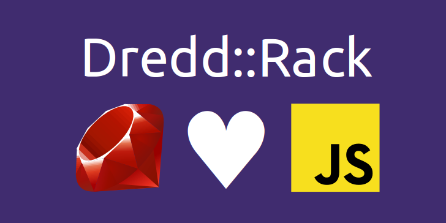

Dredd::Rack Lightning Talk
==========================

A lightning talk (5min) to introduce Dredd::Rack.

Events
------

I've presented this talk at:

- [DynLang Meetup][dynlang], June 2015, Santiago, Chile

  [dynlang]: http://www.meetup.com/dynlangchile/events/221395461

Credits
-------

I included a few screenshots from the [API Blueprint official website][apib] and from the [Apiary.io][io]. All logos and trademarks depicted there belong to their authors.

The [Javascript][js] logo was released by [Ebramino](https://commons.wikimedia.org/wiki/User:Ebraminio) under the Expat Licence and the [Ruby][rb] logo was released by Yukihiro Matsumoto and the Ruby Visual Identity Team under the Creative Commons Attribution-ShareAlike 2.5 Generic license.

  [apib]: https://apiblueprint.org
  [io]: https://apiary.io
  [rb]: https://commons.wikimedia.org/wiki/Category:Ruby_programming_language#/media/File:Ruby_logo.svg
  [js]: https://commons.wikimedia.org/wiki/File:JavaScript.svg

License
-------

```
Copyright © 2015 Gonzalo Bulnes Guilpain

Except otherwise stated (see credits above):

Permission is granted to copy, distribute and/or modify this document under
the terms of the GNU Free Documentation License, Version 1.3 or any later version
published by the Free Software Foundation; with no Invariant Sections,
no Front-Cover Texts, and no Back-Cover Texts.
A copy of the license can be found at http://www.gnu.org/copyleft/fdl.html.
```

